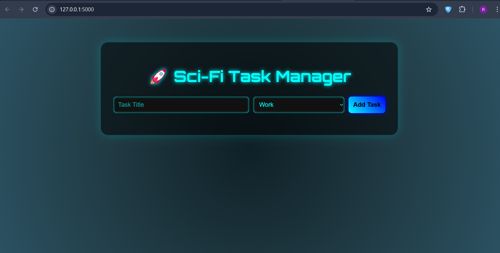

# 🚀 Futuristic To-Do App

A **Sci-Fi themed, responsive, full-stack To-Do web application** built with Flask (Python), HTML, CSS, and JavaScript.

> Designed to look like something straight out of the future 🌌 with glowing neon UI, glassy cards, and smooth interactions.



---

## ✨ Features

- 💻 Responsive design (Mobile + Desktop)
- 🌐 Flask backend with REST API
- ⚡ Real-time task adding & deleting
- 🎨 Sci-fi themed UI using `Orbitron` font & neon colors
- 🧠 Organized code structure for scalability

---

## 📂 Folder Structure

```
Futuristic_To-Do/
│
├── app.py                 # Flask backend
├── templates/
│   └── index.html         # Main HTML file
├── static/
│   ├── style.css          # Sci-fi themed CSS
│   └── script.js          # Task handling JS
└── README.md              # You're here!
```

---

## 🚀 Getting Started

### 1. Clone the Repository

```bash
git clone https://github.com/ravicyber8122004/Futuristic_To-Do.git
cd Futuristic_To-Do
```

### 2. Install Flask

```bash
pip install flask
```

### 3. Run the App

```bash
python app.py
```

Now visit [http://localhost:5000](http://localhost:5000) in your browser 🚀

---

## 📸 UI Preview

> *Futuristic cards, neon inputs, and glassy background for the ultimate sci-fi vibes.*

(💡 Add screenshot images here for better visual appeal!)

---

## 📌 Future Enhancements

- [ ] Add localStorage or database (SQLite/MySQL)
- [ ] User authentication
- [ ] Dark/light theme toggle
- [ ] Animated background (stars, particles)
- [ ] Task categories with filters

---

## 👨‍💻 Author

- **Ravi Cyber**  
- GitHub: [@ravicyber8122004](https://github.com/ravicyber8122004)

---

## ⭐ Show Your Support

If you liked this project, drop a ⭐ and consider contributing!

---


> "Code like a machine, design like a dream." — Ravi 🚀
```
